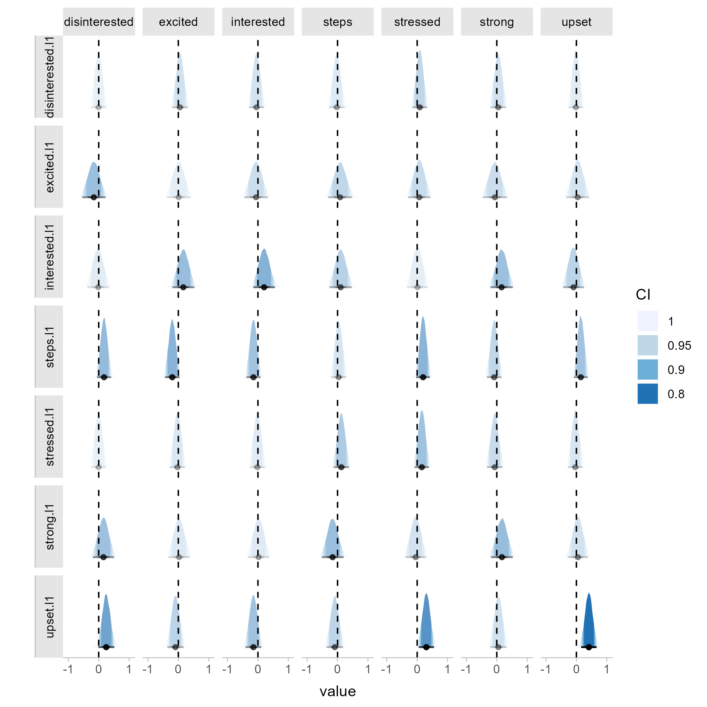
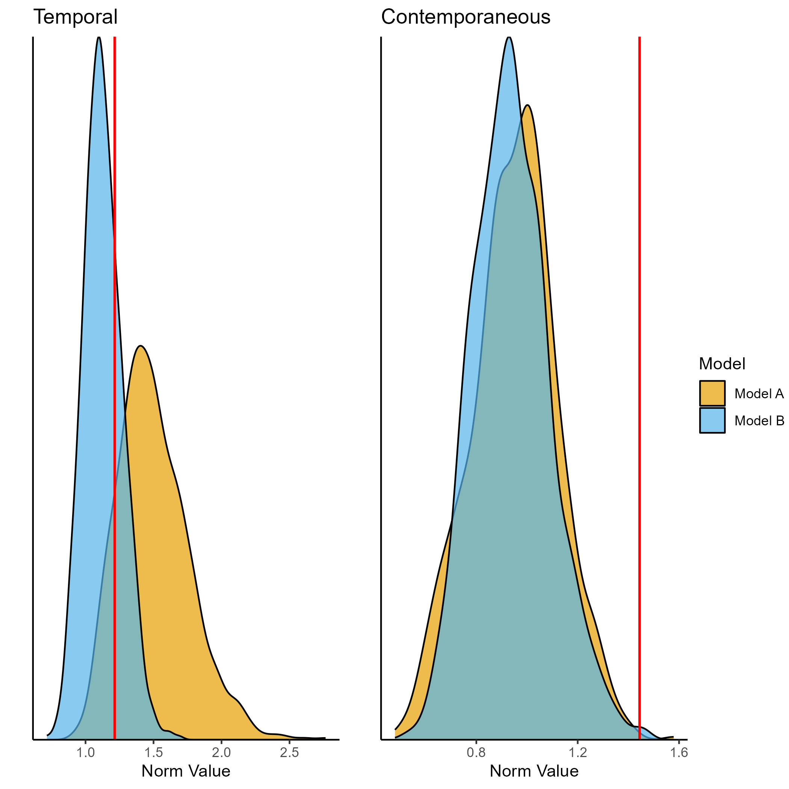

<!-- README.md is generated from README.Rmd. Please edit that file -->

```{r, include = FALSE}
knitr::opts_chunk$set(
  collapse = TRUE,
  comment = "#>",
  fig.path = "man/figures/README-",
  out.width = "100%"
)
```

# tsnet

<!-- badges: start -->
<!-- badges: end -->
Please note that this package is currently undergoing major changes as part of a manuscript revision. Please get in contact if you currently wish to use the package.

The goal of `tsnet` is to include helpful functions for dynamic network modelling in psychology and surrounding fields. The package contains functionality to estimate Bayesian GVAR models in Stan, as well as a test for network comparison. Additionally, the package includes functions to plot posterior estimates and centrality indices. 

## Installation

You can install the development version of `tsnet` from [GitHub](https://github.com/bsiepe/tsnet) with:

``` r
# install.packages("devtools")
devtools::install_github("bsiepe/tsnet")
```

This installation may take some time as the models are compiled upon installation. 

## Getting Started

### Estimating Network Models with Stan

The package includes the `stan_gvar` function that can be used to estimate a GVAR model with Stan. We use `rstan` as a backend. More details are included in the package documentation and the associated preprint.

```{r example-fit, eval = FALSE}
library(tsnet)

# Load example data
data <- tsnet::ts_data

# Estimate network
fit_stan <- tsnet::stan_gvar(data[,-7],
                 cov_prior = "IW",
                 iter_warmup = 500,
                 iter_sampling = 500,
                 n_chains = 4)

```


### Comparing Network Models

This is an example of how to use the package to compare two network models. We use here BGGM to estimate the networks, but the `stan_gvar` function can be used as well.

```{r example-test, eval = FALSE}
library(BGGM)
library(tsnet)


# Load data of two individuals
data <- BGGM::ifit
data_1 <- subset(data, id == 1)
data_3 <- subset(data, id == 3)

# Estimate networks
# (should perform detrending etc. in a real use case)
net_1 <- BGGM::var_estimate(data_1[,-1],
                            rho_sd = 0.25, 
                            beta_sd = 0.5,
                            iter = 50000)
net_3 <- BGGM::var_estimate(data_3[,-1],
                            rho_sd = 0.25, 
                            beta_sd = 0.5,
                            iter = 50000)

# Plot individual temporal network estimates
post_plot_1 <- tsnet::posterior_plot(net_1)

```




You can then compare these networks, summarize the results and plot the test results:
```{r compare, eval = FALSE}
# Compare networks
compare_13 <- tsnet::compare_gvar(net_1, 
                    net_3,
                    return_all = TRUE)

# Print summary of results
print(compare_13)

# Plot test results
test_plot_13 <- plot(compare_13,
                     name_a = "Model A",
                     name_b = "Model B")
```



## References
If you use the package, please cite the preprint that introduces the package and the test: 

Siepe, B.S. & Heck, D.W. (2023). Bayesian Estimation and Comparison of Idiographic Network Models. (https://psyarxiv.com/uwfjc/)
