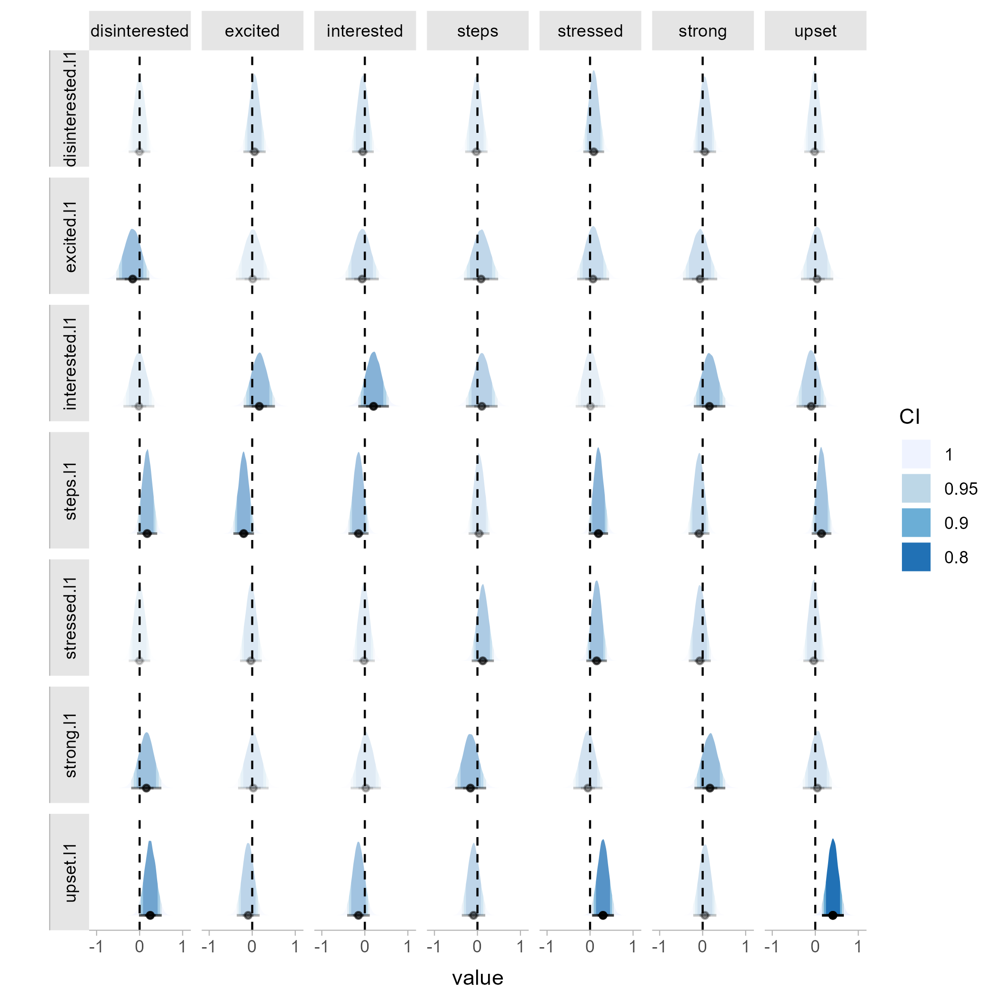
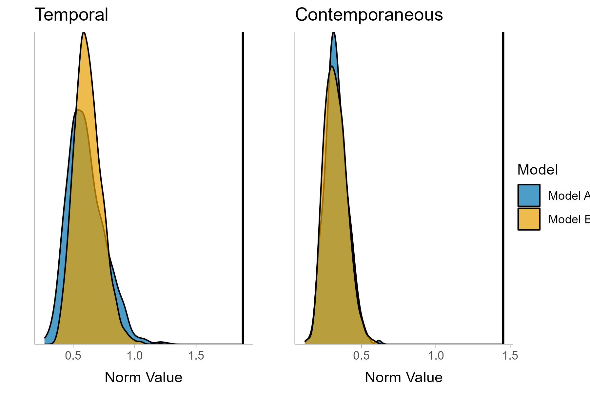

<!-- README.md is generated from README.Rmd. Please edit that file -->

# tsnet

<!-- badges: start -->
<!-- badges: end -->

Please note that this package is currently undergoing major changes as
part of a manuscript revision. Please get in contact if you currently
wish to use the package.

The goal of tsnet is to include helpful functions for dynamic network
modelling in psychology and surrounding fields. Currently, the core of
the package is the comparison of Bayesian gVAR models as estimated in
the `BGGM` package.

## Installation

You can install the development version of `tsnet` from
[GitHub](https://github.com/bsiepe/tsnet) with:

``` r
# install.packages("devtools")
devtools::install_github("bsiepe/tsnet")
```

## Getting Started

This is an example of how to use the package to compare two network
models:

``` r
library(BGGM)
library(tsnet)


# Load data of two individuals
data <- BGGM::ifit
data_1 <- subset(data, id == 1)
data_3 <- subset(data, id == 3)

# Estimate networks
# (should perform detrending etc. in a real use case)
net_1 <- BGGM::var_estimate(data_1[,-1],
                            rho_sd = 0.25, 
                            beta_sd = 0.5,
                            iter = 50000)
net_3 <- BGGM::var_estimate(data_3[,-1],
                            rho_sd = 0.25, 
                            beta_sd = 0.5,
                            iter = 50000)

# Plot individual temporal network estimates
post_plot_1 <- tsnet::posterior_plot(net_1)
```



You can then compare these networks, summarize the results and plot the
test results:

``` r
# Compare networks
compare_13 <- tsnet::compare_gvar(net_1, 
                    net_3,
                    return_all = TRUE)

# Print summary of results
print(compare_13)

# Plot test results
test_plot_13 <- plot(compare_13,
                     name_a = "Model A",
                     name_b = "Model B")
```



## References

If you use the package, please cite the preprint that introduces the
package and the test:

Siepe, B.S. & Heck, D.W. (2023). Bayesian Estimation and Comparison of
Idiographic Network Models. (<https://psyarxiv.com/uwfjc/>)
