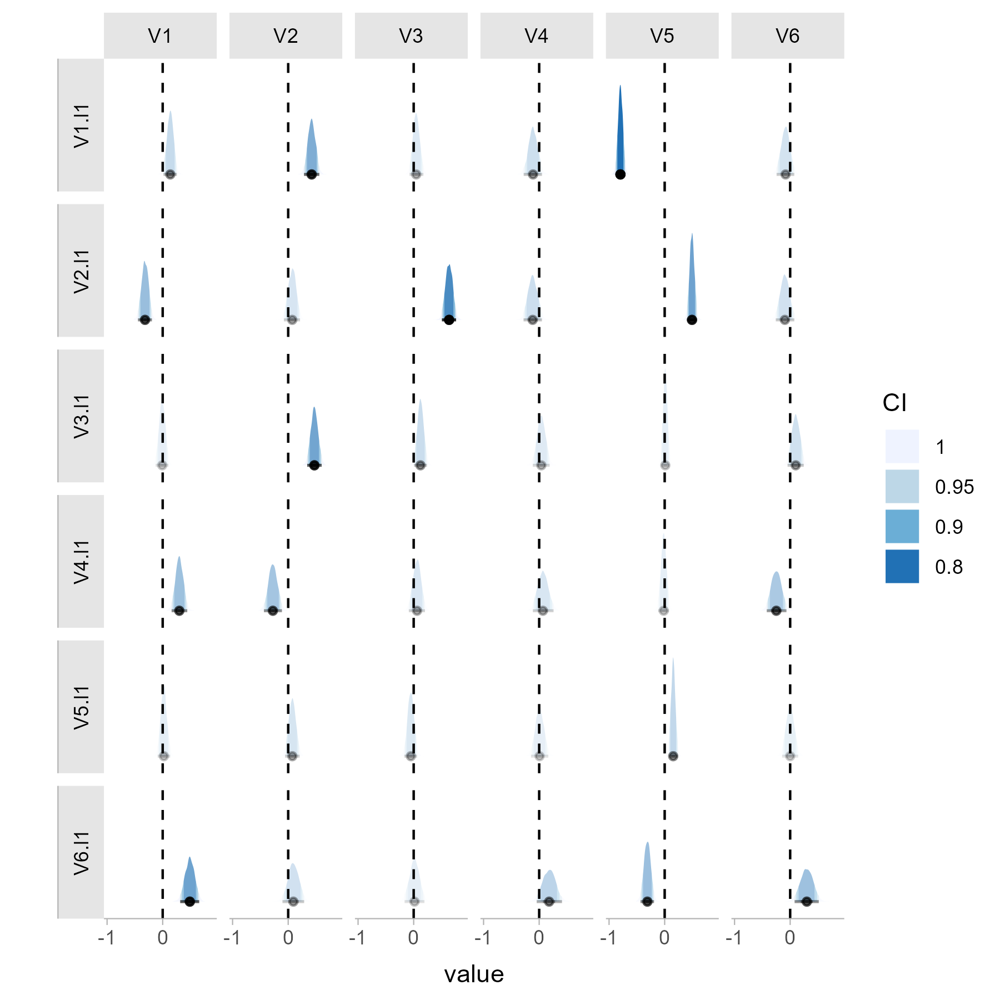

<!-- README.md is generated from README.Rmd. Please edit that file -->

# tsnet

<!-- badges: start -->

[](https://github.com/bsiepe/tsnet/actions/workflows/R-CMD-check.yaml)
<!-- badges: end -->

The goal of `tsnet` is to include helpful functions for dynamic network
modelling in psychology and surrounding fields. The package contains
functionality to estimate Bayesian GVAR models in Stan, as well as a
test for network comparison. Additionally, the package includes
functions to plot posterior estimates and centrality indices. More
information is provided in the associated paper [Siepe et
al. (2024)](https://doi.org/10.1037/met0000672) (Preprint available
[here](https://osf.io/preprints/psyarxiv/uwfjc/)).

## Installation

You can install the released version of `tsnet` from
[CRAN](https://CRAN.R-project.org) with:

``` r
install.packages("tsnet")
```

You can install the development version of `tsnet` from
[GitHub](https://github.com/bsiepe/tsnet) with:

``` r
# install.packages("devtools")
devtools::install_github("bsiepe/tsnet")
```

The installation may take some time as the models are compiled upon
installation.

## Getting Started

### Estimating Network Models with Stan

The package includes the `stan_gvar` function that can be used to
estimate a GVAR model with Stan. We use `rstan` as a backend. More
details are included in the package documentation and the associated
preprint.

``` r
library(tsnet)

# Load example data
data(ts_data)

# use data of first individual
data <- subset(ts_data, id == "ID1")

# Estimate network
fit_stan <- stan_gvar(data[,-7],
                 cov_prior = "IW",
                 iter_warmup = 500,
                 iter_sampling = 500,
                 n_chains = 4)

# print summary
print(fit_stan)
```

### Comparing Network Models

This is an example of how to use the package to compare two network
models. We use here BGGM to estimate the networks, but the `stan_gvar`
function can be used as well.

``` r
library(tsnet)

# Load simulated time series data of two individuals
data(ts_data)
data_1 <- subset(ts_data, id == "ID1")
data_2 <- subset(ts_data, id == "ID2")

# Estimate networks
# (should perform detrending etc. in a real use case)
net_1 <- stan_gvar(data_1[,-7],
                   iter_sampling = 1000,
                   n_chains = 4)
net_2 <- stan_gvar(data_2[,-7],
                   iter_sampling = 1000,
                   n_chains = 4)

# Plot individual temporal network estimates
post_plot_1 <- posterior_plot(net_1)
```



You can then compare these networks, summarize the results and plot the
test results. In this case, the test is significant for both the
temporal and the contemporaneous network.

``` r
# Compare networks
compare_13 <- compare_gvar(net_1, 
                           net_2,
                           return_all = TRUE,
                           n_draws = 1000)

# Print summary of results
print(compare_13)

# Plot test results
test_plot_13 <- plot(compare_13,
                     name_a = "Model A",
                     name_b = "Model B")
```


## References

If you use the package, please cite the paper that introduces the
package and the test:

Siepe, B. S., Kloft, M., & Heck, D. W. (2024). Bayesian estimation and
comparison of idiographic network models. *Psychological Methods*.
Advance online publication. <https://doi.org/10.1037/met0000672>

As a BiBTeX entry:

``` bibtex
@article{siepe2024bayesian,
  title={Bayesian estimation and comparison of idiographic network models},
  author={Siepe, Björn S. and Kloft, Matthias and Heck, Daniel W.},
  journal={Psychological Methods},
  issue={Advance online publication},
  year={2024},
  doi={10.1037/met0000672}
}
```
